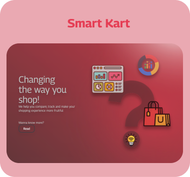
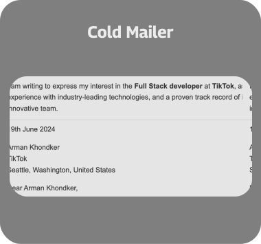
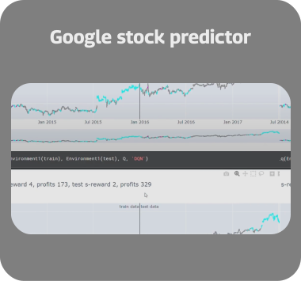
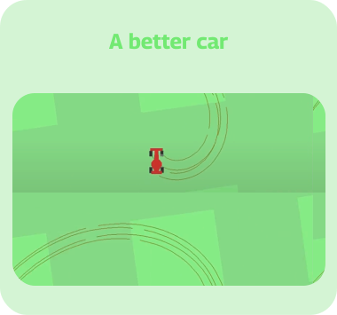
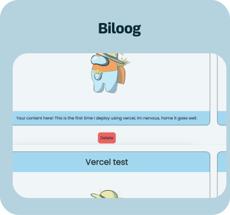

## Your friendly neighborhood nerd...

- 🧐 Next.js developer and versed in MERN stack
- 🍀 love experimenting with [Explainable AI](https://drive.google.com/file/d/1TlxDpFiHSNI7NV5h4QK46R2PioU7M5lJ/view), [Deep Q Networks](https://github.com/avneets2103/RL-stock-predictor) and [Neural Networks](https://github.com/avneets2103/BotNet-detection/tree/main)
- 🔭 Currently working on my Bachelors Thesis Project (BTP)
- 🌱 and making projects to scale up
- ⚡ SHAZAM ... oops still human! 

**Find me via:**

<be>

# 🎁 Gift for you:

# 💻 Tech Stack:

# My Contributions vs 🐍

  

    
  

   

# 📊 GitHub Stats:

  
  &nbsp;
  
  &nbsp;
<!--    -->

## **Projects**:

   &nbsp; &nbsp; &nbsp;
    &nbsp; &nbsp; &nbsp;
    &nbsp; &nbsp; &nbsp;
   
   
    &nbsp; &nbsp; &nbsp;
    &nbsp; &nbsp; &nbsp;
    &nbsp; &nbsp; &nbsp;
   
   
    &nbsp; &nbsp; &nbsp;
    &nbsp; &nbsp; &nbsp;
    &nbsp; &nbsp; &nbsp;

### and adding.

---

